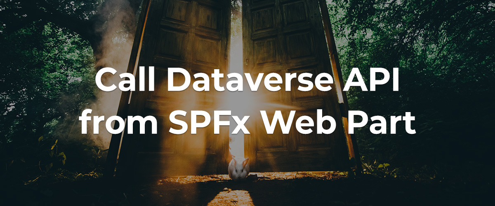
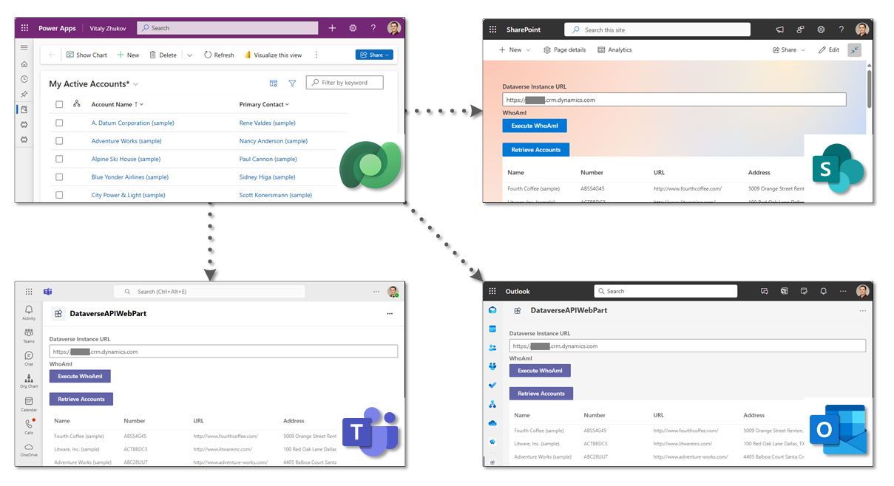
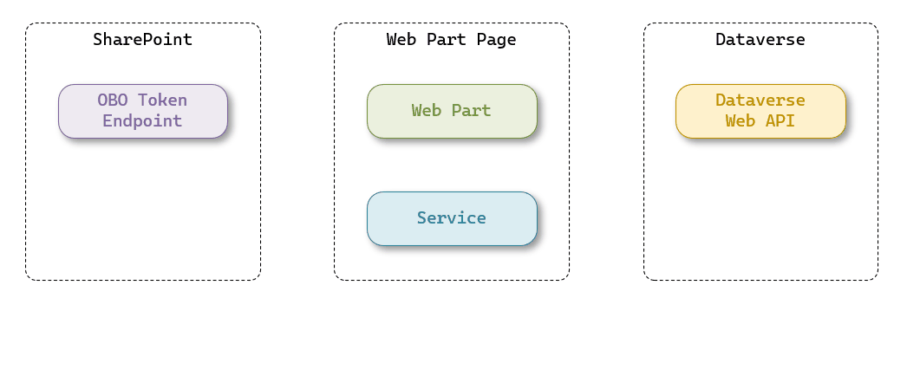

# Call Dataverse API from SPFx Web Part

## Summary

SharePoint Framework (SPFx) that retrieves data from Dataverse and displayes it on SharePoint page, Outlook, and Microsoft Teams.

Blog Post: [Call Dataverse API from SPFx Web Part](https://vitalyzhukov.com/en/call-dataverse-api-from-spfx-web-part)

## Used SharePoint Framework Version

## Applies to

- [SharePoint Framework](https://aka.ms/spfx)
- [Microsoft 365 tenant](https://docs.microsoft.com/en-us/sharepoint/dev/spfx/set-up-your-developer-tenant)

> Get your own free development tenant by subscribing to [Microsoft 365 developer program](http://aka.ms/o365devprogram)

## Prerequisites

> Any special pre-requisites?

## Version history

| Version | Date             | Comments        |
| ------- | ---------------- | --------------- |
| 1.0.0     | September 12, 2024 | Initial release |

## Disclaimer

**THIS CODE IS PROVIDED _AS IS_ WITHOUT WARRANTY OF ANY KIND, EITHER EXPRESS OR IMPLIED, INCLUDING ANY IMPLIED WARRANTIES OF FITNESS FOR A PARTICULAR PURPOSE, MERCHANTABILITY, OR NON-INFRINGEMENT.**

---

## Minimal Path to Awesome

- Clone this repository
- Ensure that you are at the solution folder
- in the command-line run:
  - **npm install**
  - **gulp serve**

## Features

The web part meets the following requirements:

1. Execute and display result of the WhoAmI request.
2. Display list of entities (accounts).
3. Support SharePoint, Outlook, and Microsoft Teams as a hosted platform.

### Execution Flow

To execute the process, there are a few key steps involved. First, the web app uses a service that handles authentication and calls to the API. This service gets an OAuth token from a special endpoint in SharePoint, which helps with secure token exchange. This OBO (On-Behalf-Of) token allows the app to act on your behalf, so it can safely access and work with the Dataverse API.

Once it has the token, the service uses it to log in to the Dataverse, so the app can access data. By following these steps, the web part can easily connect with the Power Platform.

## References

- [My Blog](https://vitalyzhukov.com/)
- [Use the Microsoft Dataverse Web API](https://learn.microsoft.com/en-us/power-apps/developer/data-platform/webapi/overview?view=dataverse-latest)
- [Getting started with SharePoint Framework](https://docs.microsoft.com/en-us/sharepoint/dev/spfx/set-up-your-developer-tenant)

